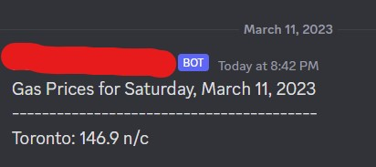

## Gas Price Scraper & Upload to Discord
Scrapes gas prices off the internet and uploads it to a specific Discord channel.
## Table of Contents
- [How to Use](#How to Use)
- [Automation for the Script](#Automation for the Script)
- [Example Output](#Example Output)
- [Conclusion](#conclusion)
- [List of Available Cities](#List of Available Cities)
- [References](#References)

## How to Use
You can add additional/remove cities on lines 14 - 18 (list of cities will be listed in the "Cities" section). If addtional cities are removed or added, go to line 56 and change that as well.

Additionally, you must know your BOT_TOKEN and CHANNEL_ID for your discord server and channel you want to upload (see reference [1] and [2] for finding those information).
## Automation for the Script
To run this automatically, you can use Windows Task Scheduler. Check out [3] for a video guide on how to do that.
## Example Output

Here is what the example output would look like:

## List of Available Cities

Here are the list of Cities:

- Toronto
- Montreal
- Vancouver
- Calgary
- Barrie
- Brampton
- Charlottetown
- Cornwall
- Edmonton
- Fredericton
- GTA
- Halifax
- Hamilton
- Kamloops
- Kelowna
- Kingston
- London
- Markham
- Mississauga
- Moncton
- Niagara
- Oakville
- Oshawa
- Ottawa
- Peterborough
- Prince George
- Quebec City
- Regina
- Saskatoon
- St Catharines
- St John (NB)
- St. John's
- Sudbury
- Thunder Bay
- Victoria
- Waterloo
- Windsor
- Winnipeg
## References

[1] https://www.writebots.com/discord-bot-token/

[2] https://support.discord.com/hc/en-us/articles/206346498-Where-can-I-find-my-User-Server-Message-ID-

[3] https://www.youtube.com/watch?v=ic4lUiDTbVI
