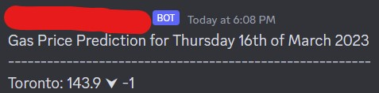

# Gas Price Scraper & Upload to Discord

## Table of Contents

- [Introduction](#Introduction)
- [Installation Requirements](#Installation-Requirements)
- [Automation for the Script](#Automation-for-the-Script)
- [Example Output](#Example-Output)
- [Symbol Legend](#Symbol-Legend)
- [List of Available Cities](#List-of-Available-Cities)
- [References](#References)

<h2 id="#Introduction">Introduction</h2>

The premise of this project is to scrape gas prices off of a targeted website and automatically upload the parsed information onto a Discord channel of your choice. You can add additional/remove cities on **lines 13 - 17 of the code** (list of cities will be listed in the [List of Available Cities](#List-of-Available-Cities) section). If **addtional cities are removed or added, go to line 58 and change that as well in the code.**

Additionally, you **must know your bot token and channel ID** if you want to upload on Discord (see reference [[1]](#References) and [[2]](#References) for finding this information as well as on how to create a quick bot).

<h2 id="#Installation-Requirements">Installation Requirements</h2>

Here are all the required links to install onto your machine before you run the code:

1. https://www.python.org/downloads/
2. https://pip.pypa.io/en/stable/installation/#
3. https://pypi.org/project/requests/
4. https://pypi.org/project/beautifulsoup4/
5. https://lxml.de/installation.html

<h2 id="#Automation-for-the-Script">Automation for the Script</h2>

To run this automatically, you can use Windows Task Scheduler. Check out [[3]](#References) for a video guide on how to do that.

 <h2 id="#Example-Output">Example Output</h2>

Here is what the example output would look like:

<h2 id="#Symbol-Legend">Symbol Legend</h2>

A note for the symbols that represent changes within the prices: 

⮝ denotes prices gone up for the listed date

⮟ denotes prices gone down for the listed date

n/c denotes "No Changes" for the listed date

<h2 id="#List-of-Available-Cities">List of Available Cities</h2>

Here are the list of Cities:

- Toronto
- Montreal
- Vancouver
- Calgary
- Barrie
- Brampton
- Charlottetown
- Cornwall
- Edmonton
- Fredericton
- GTA
- Halifax
- Hamilton
- Kamloops
- Kelowna
- Kingston
- London
- Markham
- Mississauga
- Moncton
- Niagara
- Oakville
- Oshawa
- Ottawa
- Peterborough
- Prince George
- Quebec City
- Regina
- Saskatoon
- St Catharines
- St John (NB)
- St. John's
- Sudbury
- Thunder Bay
- Victoria
- Waterloo
- Windsor
- Winnipeg
## References

[1] https://www.writebots.com/discord-bot-token/

[2] https://support.discord.com/hc/en-us/articles/206346498-Where-can-I-find-my-User-Server-Message-ID-

[3] https://www.youtube.com/watch?v=ic4lUiDTbVI

[4] https://gaswizard.ca/gas-price-predictions/
